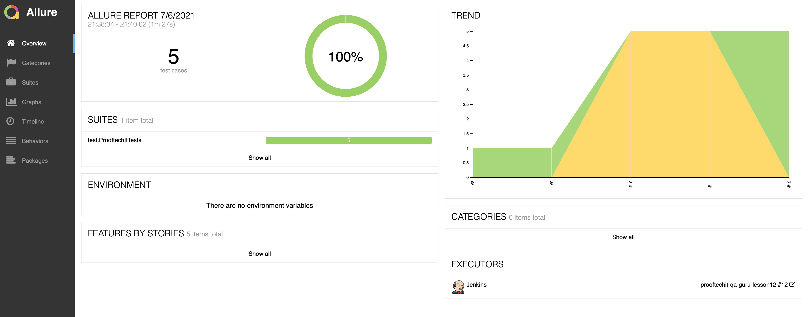

# [Playwright automation on Typescript](https://playwright.dev/)

## Table of contents

- [Requirements](#requirements)
- [Coverage](#coverage)
- [Environment variables](#environment-variables)
- [How to install](#how-to-install)
- [How to run](#how-to-run)
- [CI](#ci)
- [Reporting](#reporting)
- [Notifications](#notifications)
- [Examples](#examples)
- [Maintainer](#Maintainer)

----
## Requirements

|                                  Typescript                                   | Node.js | Playwright | CircleCI | Github Actions | Allure Report | Telegram |
|:-----------------------------------------------------------------------------:|---------|:----------:|:--------:|:--------------:|:-------------:|:--------:|
| <a href="url"></a> |         |            |          |                |               |          |

----
## Coverage

[TBD]

----
## Environment variables

|  URL  | Env2  |
|:-----:|:-----:|
| [TBD] | [TBD] |

----
## How to install

1. To install all packages from package.json use command ```npm i```
2. (Optional) Create folder ```screenshots``` in your projects root folder.
3. (Optional) Install cross-env with command ```npm install cross-env```
----
## How to run

To run the tests, use the command:

```
npm test
```

To run tests with an open browser, use the command:

```
npm run test:headed
```

To check your code, run eslint with the command:

```
npm run lint
```
And other commands in scripts in ```package.json```

----
## CI

You can use two CI's in this project: 


|                                                                             CircleCI                                                                             |                                                                                          Github Actions                                                                                          |
|:----------------------------------------------------------------------------------------------------------------------------------------------------------------:|:------------------------------------------------------------------------------------------------------------------------------------------------------------------------------------------------:|
|   [](https://circleci.com/gh/Leitirion/Playwright-tests/tree/master)    |     [](https://github.com/Leitirion/Playwright-tests/actions/workflows/ui-checks.yaml)     |

----
## Reporting

In this project, you can use Allure Report with commands: 
1) To run tests with Allure 

```
npm run test:allure
```
2) To open Allure Report page 
```
allure serve
```


----
## Notifications

In this project, you have telegram notifications after running tests in CI.

----
## Examples

In this project, in a folder ```<project_name>/tests/**``` you can find some test examples.

----
## Maintainer
[github.com/leitirion](https://github.com/leitirion)

:writing_hand: :iphone: Telegram - [**@Leitirion**](https://t.me/leitirion)